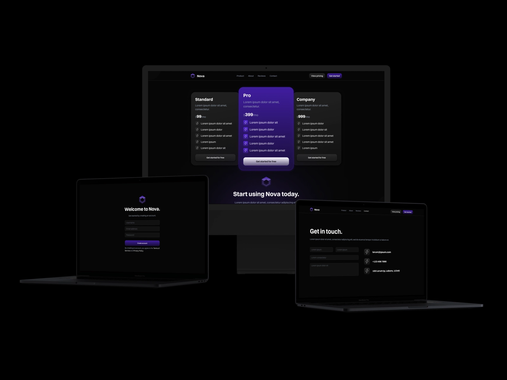
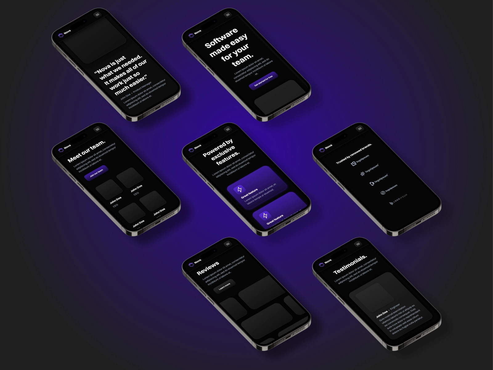

# Software Landing Page Template

### Hi!

**TL;DR:** This is a template for a website presenting some type of productivity software. It's a great template to showcase your own product! **To use it, just fork the Repl and edit the content! :)**

It has the following sections/pages:

- Navbar
- Landing	page
	- Trusted by
	- Features (multiple & individual)
- Product page
- About page
	- Values
  - Image gallery
  - Team
- Reviews page
	- Testimonials
  - Companies
- Contact page
	- Form
  - Contact information
- Pricing page
- CTA (call to action)
- Footer

This website is completely responsive, meaning that you can view it on any device, like computer, tablet, or phone!

The general style of this site is meant to be modern, clean, and simple. It includes themes like boldness, technology, futuristic, etc. Sleek shadows and smooth gradients are combined with some neumorphic elements for a nice contrast.

It's a great template you can use for your own landing pages!

***

## Links

* [Site/Demo](https://Software-Landing-Page-Template.bookie0.repl.co)

* [Code](https://replit.com/@Bookie0/Software-Landing-Page-Template#README.md)
  
* [Dribbble collection](https://dribbble.com/Bookie0/collections/5932799-Nova)

***

## How

To use this template, **simply fork the Repl**. You can replace all of the content by **editing the text in the `.html` files** (you might have to open the folders). 

***

## Closing 

Hope you enjoy this template! 

If you have any questions, or if something doesn't work, please feel free to [get in touch](https://bookie0.repl.co/)! 

